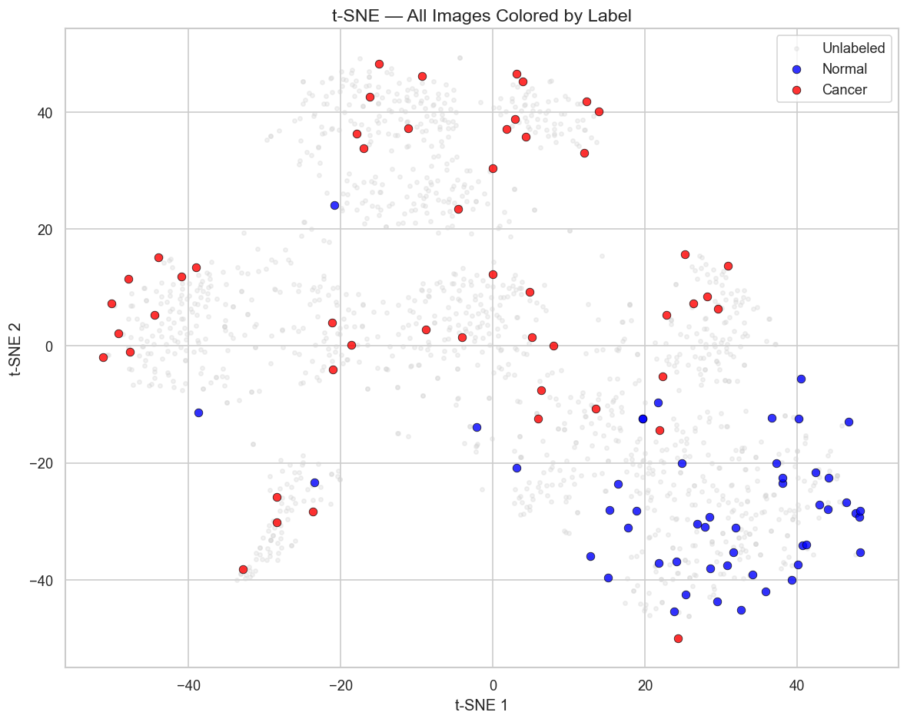
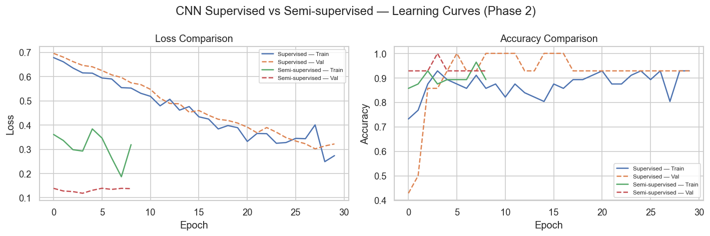
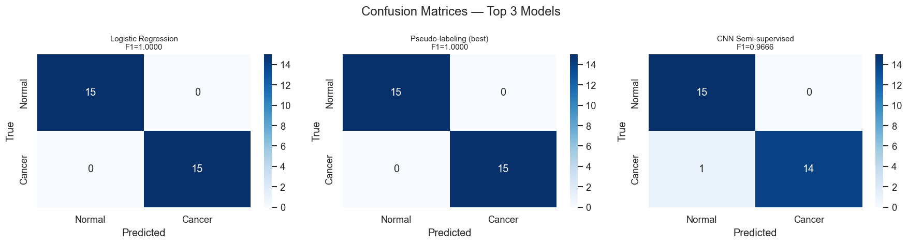
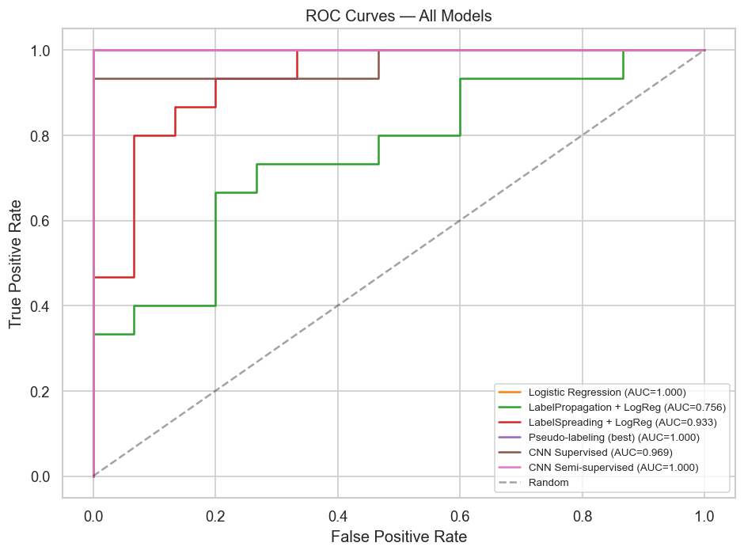

# BrainScanAI — Détection semi-supervisée de tumeurs cérébrales

Projet OpenClassrooms — Apprentissage semi-supervisé appliqué à l'analyse d'images IRM cérébrales.

## Contexte

CurelyticsIA (scénario fictif), startup spécialisée en IA médicale, souhaite automatiser la détection de tumeurs cérébrales à partir d'images IRM. Le coût élevé de l'annotation par radiologue (3-5 EUR/image) limite la taille des jeux de données labellisés. Ce projet explore l'apprentissage semi-supervisé pour exploiter un grand volume d'images non annotées aux côtés d'un petit jeu d'annotations expertes.

## Jeu de données

- 1 506 images IRM cérébrales (512×512 JPEG, niveaux de gris)
- 100 annotées : 50 Normal + 50 Cancer
- 1 406 non annotées
- Découpage : 70 entraînement / 30 test (stratifié, scellé)

Le jeu de données est fourni séparément par OpenClassrooms.

## Livrables

| Fichier | Contenu |
|---|---|
| `Delabie_Ghislain_1_Notebook_042025.ipynb` | Extraction de features (ResNet-50), ACP, t-SNE, clustering (K-Means, DBSCAN), weak labels |
| `Delabie_Ghislain_2_Notebook_042025.ipynb` | Baselines, Label Propagation, pseudo-labeling, CNN supervisé vs semi-supervisé, analyse statistique, scaling |
| `Delabie_Ghislain_3_Presentation_042025.pptx` | Support de présentation pour la soutenance (15 slides) |

## Méthodologie

```
Images IRM → ResNet-50 (pré-entraîné) → Embeddings 2048-dim
                                              ↓
                        ACP (50-dim) → t-SNE (viz 2D) → Clustering
                                              ↓
        Label Propagation → Pseudo-Labeling → Fine-tuning CNN → Évaluation
```

## Analyse non supervisée

Visualisation t-SNE des embeddings ResNet-50. Les classes Normal (bleu) et Cancer (rouge) sont entièrement mélangées : les features ImageNet ne capturent pas les différences pathologiques, elles capturent des propriétés globales (luminosité, texture, contours).



Le clustering K-Means confirme ce constat (ARI ≈ 0) : les clusters détectés ne correspondent pas aux classes. C'est un résultat négatif informatif qui motive le besoin d'un signal supervisé.

## Comparaison CNN : supervisé vs semi-supervisé

Le pré-entraînement du CNN sur 1 406 images pseudo-annotées améliore nettement la généralisation lors du fine-tuning sur les 56 images annotées :



Matrices de confusion des trois meilleurs modèles sur le jeu de test (30 images) :



Courbes ROC — tous les modèles comparés :



## Résultats clés

| Modèle | Accuracy | F1 (macro) | Recall Cancer |
|---|---|---|---|
| DummyClassifier | 50,0 % | 0,33 | - |
| Régression logistique (ResNet features) | 100 %* | 1,00 | 1,00 |
| Label Propagation | 50,0 % | 0,33 | 0,00 |
| Pseudo-labeling | 100 %* | 1,00 | 1,00 |
| **CNN supervisé** | **80,0 %** | **0,79** | **0,60** |
| **CNN semi-supervisé** | **96,7 %** | **0,97** | **0,93** |

\* Effet plafond sur 30 échantillons test. La validation croisée sur 70 échantillons donne 91 % ± 7 % pour LogReg, qui est l'estimation plus fiable.

**Résultat principal** : le pré-entraînement CNN sur 1 406 images pseudo-annotées améliore le recall Cancer de +33 points (60 % → 93 %), réduisant les faux négatifs (tumeurs manquées) de 6 à 1 sur 15.

## Technologies

- Python 3.11
- PyTorch 2.11, torchvision 0.26
- scikit-learn 1.8
- numpy, pandas, matplotlib, seaborn, Pillow

## Exécution

```bash
# Créer l'environnement
conda create -n OC10 python=3.11 -y
conda activate OC10
pip install -r requirements.txt

# Placer les données dans data/mri_dataset_brain_cancer_oc/
# puis lancer Jupyter
jupyter lab
```

Les notebooks s'exécutent dans l'ordre : Notebook 1 produit les embeddings et weak labels utilisés par Notebook 2.

## Licence

MIT — voir [LICENSE](LICENSE).

## Auteur

Ghislain Delabie — Formation OpenClassrooms, projet OC10.
